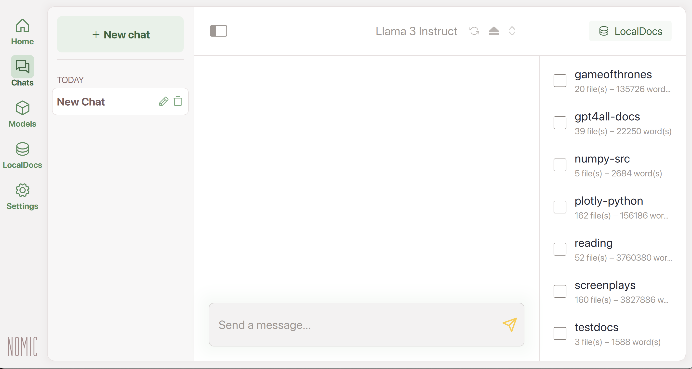

# Chats

Chats are conversations with [language models](models.md) that run locally on your device.

!!! note "Example Chats"

    === "Llama 3"
        Download `Llama 3` and prompt:
        ```
        explain why the sky is blue in a way that is correct and makes sense to a child
        ```

        With the default sampling settings, you should see text resembling the following:

        ```
        What a great question!
        So, you know how we can see different colors like red, yellow, green, and orange? Well, when sunlight enters Earth's atmosphere, it starts to interact with tiny particles called molecules of gases like nitrogen (N2) and oxygen (02). These molecules are really small, but they're all around us!
        Now, here's the cool part: these molecules scatter, or bounce off, shorter wavelengths of light more than longer wavelengths. Think of it like a game of pool where the cue ball hits other balls with different sizes and speeds.
        The shortest wavelength of visible light is violet (about 400 nanometers), followed by blue (around 450-495 nanometers). These shorter wavelengths are scattered in all directions, kind of like how a basketball player might bounce the ball around on the court. This scattering effect makes the sky appear blue to our eyes!
        Here's why it doesn't look as bright or intense as a blue crayon: there are many more molecules in the atmosphere that scatter longer wavelengths (like red and orange) than shorter ones, so those colors get spread out and become less noticeable.
        To sum it up:
        1. Sunlight enters Earth's atmosphere.
        2. Tiny gas molecule particles interact with light, scattering shorter wavelengths like blue and violet.
        3. This scattered blue light reaches our eyes from all directions, making the sky appear blue!
        Now, go outside and enjoy that beautiful blue sky!
        ```

    === "Nous Hermes 2 Mistral DPO"
        Download `Nous Hermes 2 Mistral DPO` and prompt:
        ```
        write me a react app i can run from the command line to play a quick game
        ```

        With the default sampling settings, you should see text and code blocks resembling the following:
        
        ```
        I'll provide you with a simple React app that allows you to play a guessing game. This app will generate a random number between 1 and 10, and ask you to guess it. You can run this app locally using Create React App. Follow the steps below:
        Open your terminal or command line interface.
        Navigate to the directory where you want to create the project (e.g., cd Documents/Projects).
        Run the following commands:
        ```

        ```bash
        npx create-react-app guessing-game
        cd guessing-game
        ```

        ```
        Open the project in your preferred code editor by running code . (for VS Code) or any other command to open the folder with your text editor.
        Replace the content of the src/App.js file with the following code:
        ```

        ```javascript
        import React, { useState } from 'react';

        function App() {
        const [guess, setGuess] = useState('');
        const [message, setMessage] = useState('');
        const [numberToGuess, setNumberToGuess] = useState(Math.floor(Math.random() * 10) + 1);

        function handleChange(e) {
            setGuess(e.target.value);
        }

        function handleSubmit(e) {
            e.preventDefault();
            if (parseInt(guess) === numberToGuess) {
            setMessage('You guessed it right!');
            } else {
            setMessage(`Wrong guess, the correct number was ${numberToGuess}. Try again next time.`);
            }
        }

        return (
            <div>
            <h1>Guess a Number</h1>
            <p>{message}</p>
            <form onSubmit={handleSubmit}>
                <input type="number" value={guess} onChange={handleChange} />
                <button type="submit">Submit</button>
            </form>
            </div>
        );
        }

        export default App;
        ```

        ```
        Save the file and go back to your terminal or command line interface. Run npm start. This will start a local development server, and you can access the app in your browser at http://localhost:3000.
        Play the guessing game by entering a number between 1 and 10 into the input field and clicking "Submit". The app will tell you if your guess is correct or not.
        Remember that this is just a simple example, and you can expand upon it to make the game more interesting with additional features like high scores, multiple difficulty levels, etc.
        ```

## New Chat

Choose a model with the dropdown at the top of the Chats page

If you don't have any models, [download one](models.md#download-models). Once you have models, you can start chats by loading your default model, which you can configure in [settings](settings.md#application-settings)


## LocalDocs

Open the [LocalDocs](localdocs.md) panel with the button in the top-right corner to bring your files into the chat. With LocalDocs, your chats are enhanced with semantically related snippets from your files included in the model's context.



## Chat History

View your chat history with the button in the top-left corner of the Chats page.

<table>
<tr>
    <td>
    
    </td>
    <td>
    
    </td>
</tr>
</table>

You can change a chat name or delete it from your chat history at any time.
