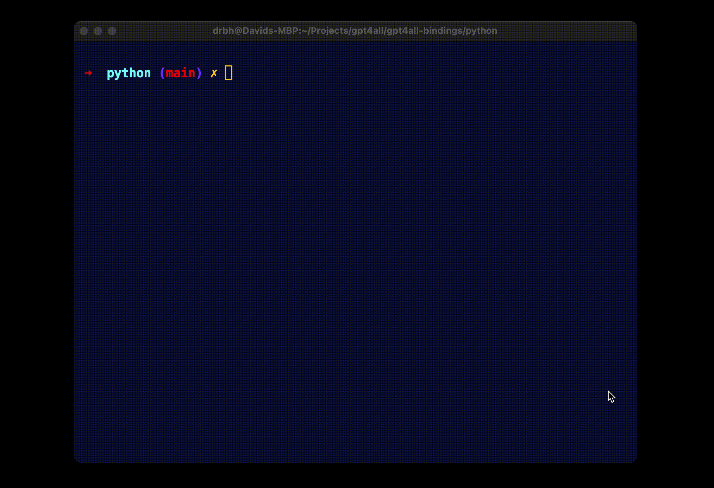

This is the Python bindings for the GPT4ALL C/C++ backend. This is a work in progress, however it is functional.

Usage:

```bash
# usage: main.py [-h] [-m MODEL]

# optional arguments:
#   -h, --help            show this help message and exit
#   -m MODEL, --model MODEL
#                         Path to the model file.

python3 main.py -m /Users/drbh/Desktop/ggml-gpt4all-j-v1.3-groovy.bin
```


