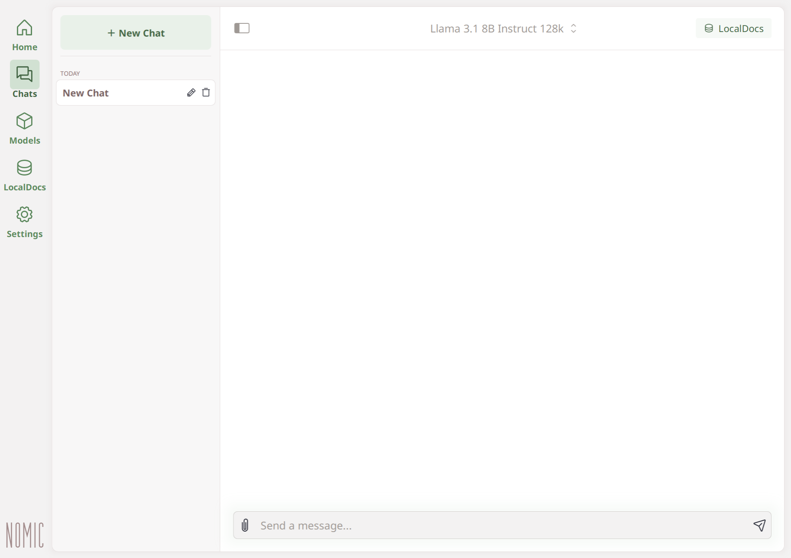
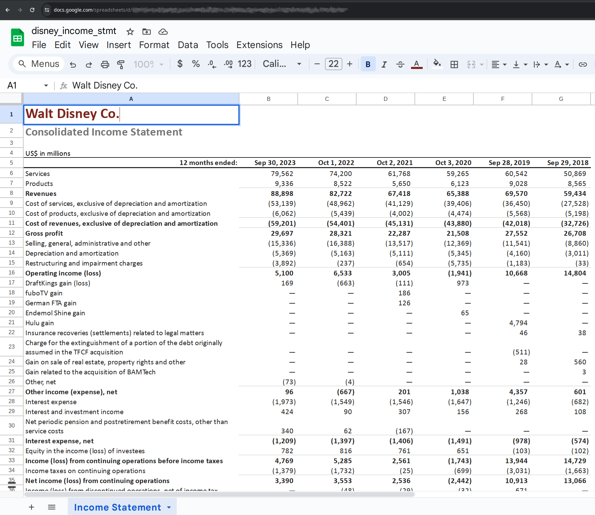
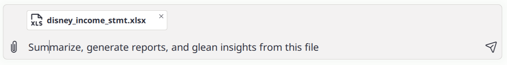
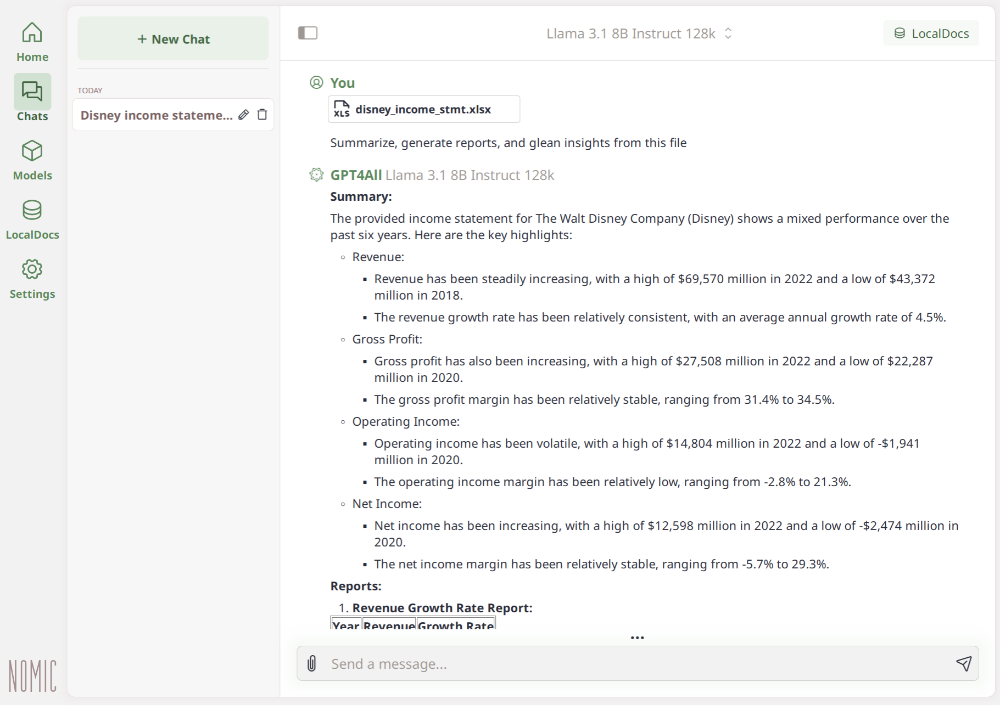

# Using GPT4All to Privately Chat with your Microsoft Excel Spreadsheets
Local and Private AI Chat with your Microsoft Excel Spreadsheets

Microsoft Excel allows you to create, manage, and analyze data in spreadsheet format. By attaching your spreadsheets directly to GPT4All, you can privately chat with the AI to query and explore the data, enabling you to summarize, generate reports, and glean insights from your files—all within your conversation.

## Attach Microsoft Excel to your GPT4All Conversation

!!! note "Attach Microsoft Excel to your GPT4All Conversation"

    1. **Install GPT4All and Open **:

        - Go to [nomic.ai/gpt4all](https://nomic.ai/gpt4all) to install GPT4All for your operating system.

        - Navigate to the Chats view within GPT4All.

        <table>
            <tr>
               <td>
                  <!-- Screenshot of Chat view -->
                  
               </td>
            </tr>
         </table>

    2. **Example Spreadsheet **:

        <table>
            <tr>
               <td>
                  <!-- Screenshot of Spreadsheet view -->
                  
               </td>
            </tr>
         </table>

    3. **Attach to GPT4All conversration**
        <table>
            <tr>
               <td>
                  <!-- Screenshot of Attach view -->
                  
               </td>
            </tr>
         </table>

    4. **Have GPT4All Summarize and Generate a Report**
        <table>
            <tr>
               <td>
                  <!-- Screenshot of Attach view -->
                  
               </td>
            </tr>
         </table>

## How It Works

GPT4All parses and attaches your excel spreadsheet to the conversation in a format understandable to the model. The model can summarize, generate reports, and glean insights from your spreadsheets all within your conversation.
