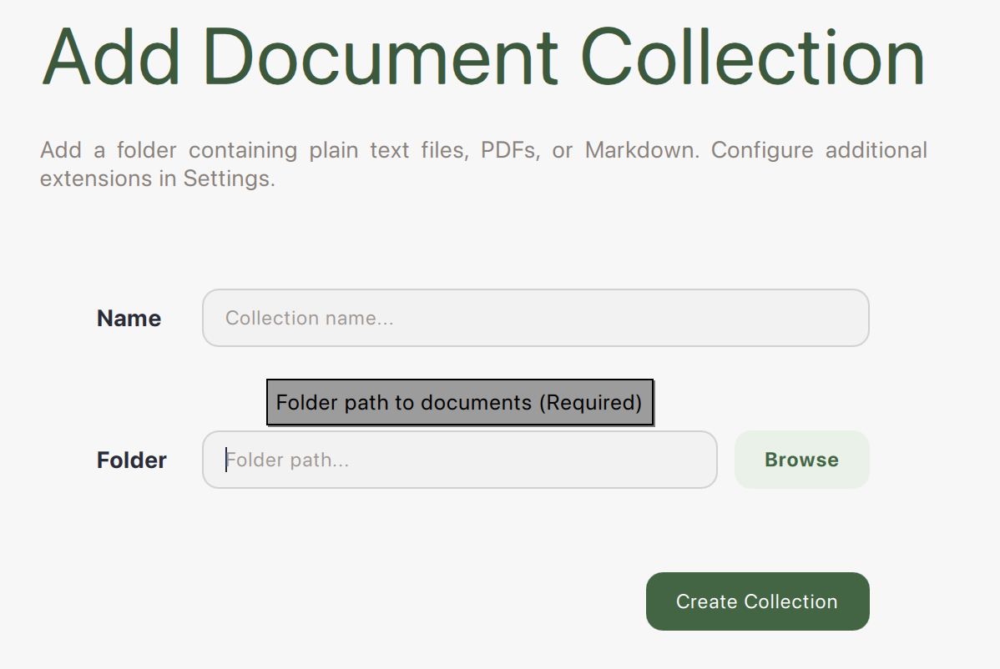

# LocalDocs

LocalDocs brings the information you have from files on-device into your LLM chats - **privately**.

## Create LocalDocs

!!! note "Create LocalDocs"

    1. Click `+ Add Collection`.
    
    2. Name your collection and link it to a folder.

        <table>
        <tr>
            <td>
            
            </td>
            <td>
            
            </td>
        </tr>
        </table>

    3. Click `Create Collection`. Progress for the collection is displayed on the LocalDocs page. 

        

        You will see a green `Ready` indicator when the entire collection is ready. 

        Note: you can still chat with the files that are ready before the entire collection is ready.

        

        Later on if you modify your LocalDocs settings you can rebuild your collections with your new settings.

    4. In your chats, open `LocalDocs` with button in top-right corner to give your LLM context from those files.

        

    5. See which files were referenced by clicking `Sources` below the LLM responses.

        

## How It Works

A LocalDocs collection uses Nomic AI's free and fast on-device embedding models to index your folder into text snippets that each get an **embedding vector**. These vectors allow us to find snippets from your files that are semantically similar to the questions and prompts you enter in your chats. We then include those semantically similar snippets in the prompt to the LLM.

To try the embedding models yourself, we recommend using the [Nomic Python SDK](https://docs.nomic.ai/atlas/capabilities/embeddings)
