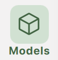
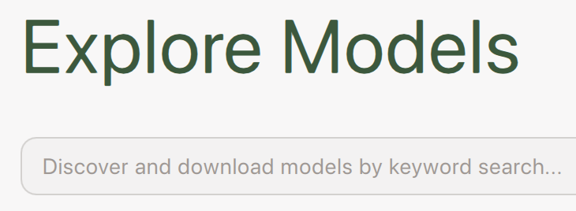
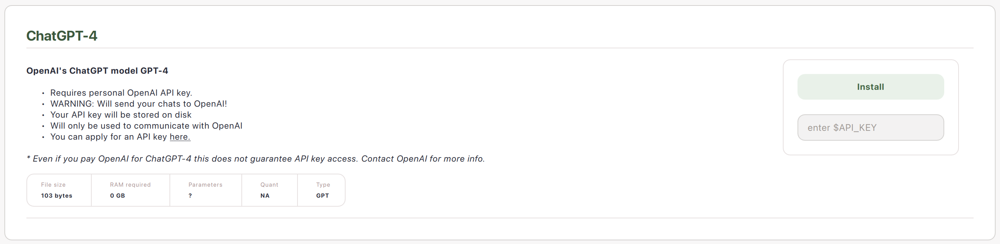

# Models

GPT4All is optimized to run LLMs in the 3-13B parameter range on consumer-grade hardware.

LLMs are downloaded to your device so you can run them locally and privately. With our backend anyone can interact with LLMs efficiently and securely on their own hardware.

## Download Models

!!! note "Download Models"

    

        <table style="margin-left: auto; margin-right: auto;">
            <tr>
                <td style="text-align: right; padding-right: 10px;">1.</td>
                <td style="text-align: left;">Click `Models` in the menu on the left (below `Chats` and above `LocalDocs`)</td>
                <td></td>
            </tr>
            <tr>
                <td style="text-align: right; padding-right: 10px;">2.</td>
                <td style="text-align: left;">Click `+ Add Model` to navigate to the `Explore Models` page</td>
                <td></td>
            </tr>
            <tr>
                <td style="text-align: right; padding-right: 10px;">3.</td>
                <td style="text-align: left;">Search for models available online</td>
                <td></td>
            </tr>
            <tr>
                <td style="text-align: right; padding-right: 10px;">4.</td>
                <td style="text-align: left;">Hit `Download` to save a model to your device</td>
                <td></td>
            </tr>
            <tr>
                <td style="text-align: right; padding-right: 10px;">5.</td>
                <td style="text-align: left;">Once the model is downloaded you will see it in `Models`.</td>
                <td></td>
            </tr>
        </table>
    

## Explore Models

GPT4All connects you with LLMs from HuggingFace with a [`llama.cpp`](https://github.com/ggerganov/llama.cpp) backend so that they will run efficiently on your hardware. Many of these models can be identified by the file type `.gguf`.

## Example Models

Many LLMs are available at various sizes, quantizations, and licenses. 

- LLMs with more parameters tend to be better at coherently responding to instructions

- LLMs with a smaller quantization (e.g. 4bit instead of 16bit) are much faster and less memory intensive, and tend to have slightly worse performance

- Licenses vary in their terms for personal and commercial use

Here are a few examples:

| Model| Filesize| RAM Required| Parameters| Quantization| Developer| License| MD5 Sum (Unique Hash)|
|------|---------|-------------|-----------|-------------|----------|--------|----------------------|
| Llama 3 Instruct  | 4.66 GB| 8 GB| 8 Billion| q4_0| Meta| [Llama 3 License](https://llama.meta.com/llama3/license/)| c87ad09e1e4c8f9c35a5fcef52b6f1c9|
| Nous Hermes 2 Mistral DPO| 4.11 GB| 8 GB| 7 Billion| q4_0| Mistral & Nous Research | [Apache 2.0](https://www.apache.org/licenses/LICENSE-2.0)| Coa5f6b4eabd3992da4d7fb7f020f921eb|
| Phi-3 Mini Instruct | 2.18 GB| 4 GB| 4 billion| q4_0| Microsoft| [MIT](https://opensource.org/license/mit)| f8347badde9bfc2efbe89124d78ddaf5|
| Mini Orca (Small)| 1.98 GB| 4 GB| 3 billion| q4_0| Microsoft | [CC-BY-NC-SA-4.0](https://spdx.org/licenses/CC-BY-NC-SA-4.0)| 0e769317b90ac30d6e09486d61fefa26|
| GPT4All Snoozy| 7.37 GB| 16 GB| 13 billion| q4_0| Nomic AI| [GPL](https://www.gnu.org/licenses/gpl-3.0.en.html)| 40388eb2f8d16bb5d08c96fdfaac6b2c|

### Search Results

You can click the gear icon in the search bar to sort search results by their # of likes, # of downloads, or date of upload (all from HuggingFace).

## Connect Model APIs

You can add your API key for remote model providers.

**Note**: this does not download a model file to your computer to use securely. Instead, this way of interacting with models has your prompts leave your computer to the API provider and returns the response to your computer.

