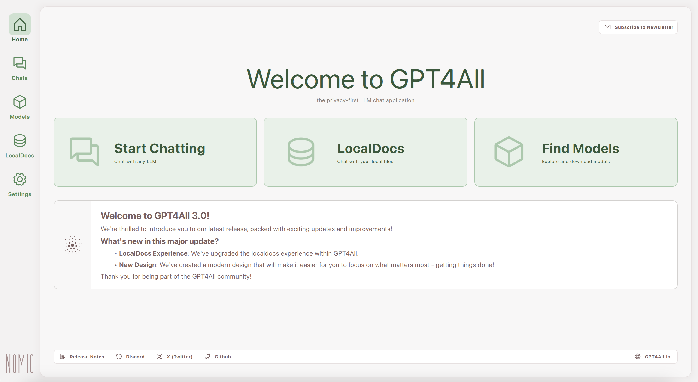
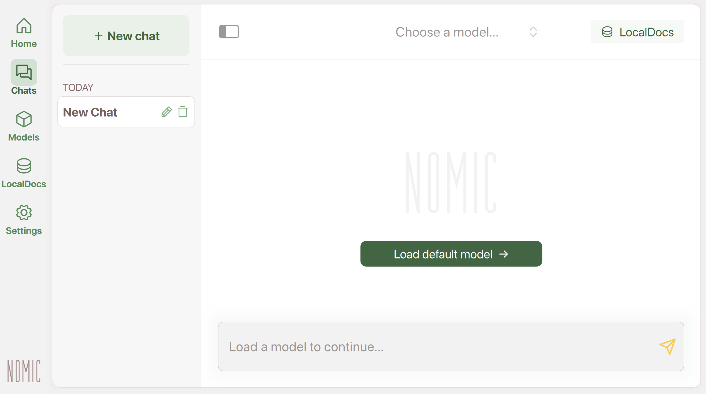
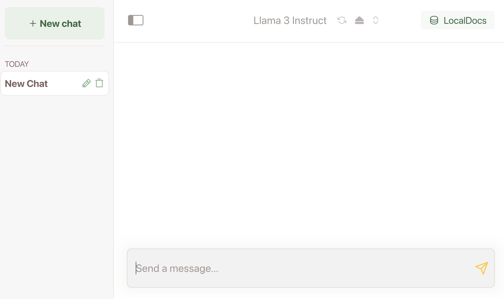

# GPT4All Desktop

The GPT4All Desktop Application allows you to download and run large language models (LLMs) locally & privately on your device.

With GPT4All, you can chat with models, turn your local files into information sources for models [(LocalDocs)](localdocs.md), or browse models available online to download onto your device.

[Official Video Tutorial](https://www.youtube.com/watch?v=gQcZDXRVJok)

## Quickstart

!!! note "Quickstart"

    1. Install GPT4All for your operating system and open the application.

        

            [Download for Windows](https://gpt4all.io/installers/gpt4all-installer-win64.exe) &nbsp;&nbsp;&nbsp;&nbsp;
            [Download for Mac](https://gpt4all.io/installers/gpt4all-installer-darwin.dmg) &nbsp;&nbsp;&nbsp;&nbsp;
            [Download for Linux](https://gpt4all.io/installers/gpt4all-installer-linux.run)
        

    2. Hit `Start Chatting`. 

    3. Click `+ Add Model`.

    4. Download a model. We recommend starting with Llama 3, but you can [browse more models](models.md). 

    5. Once downloaded, go to Chats (below Home and above Models in the menu on the left).  

    6. Click "Load Default Model" (will be Llama 3 or whichever model you downloaded). 

        <table>
        <tr>
            <td>
            
            </td>
            <td>
            
            </td>
        </tr>
        </table>

    7. Try the [example chats](chats.md) or your own prompts!
