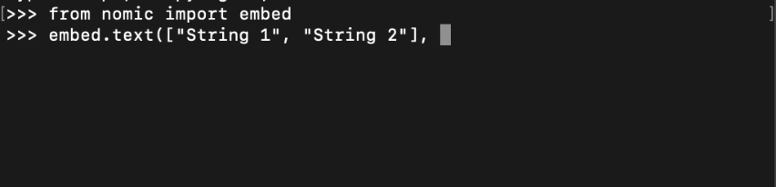

# GPT4All Python SDK

## Installation

To get started, pip-install the `gpt4all` package into your python environment.

```bash
pip install gpt4all
```

We recommend installing `gpt4all` into its own virtual environment using `venv` or `conda`

## Load LLM

Models are loaded by name via the `GPT4All` class. If it's your first time loading a model, it will be downloaded to your device and saved so it can be quickly reloaded next time you create a `GPT4All` model with the same name.

!!! note "Load LLM"

    ```python
    from gpt4all import GPT4All
    model = GPT4All("Meta-Llama-3-8B-Instruct.Q4_0.gguf") # downloads / loads a 4.66GB LLM
    with model.chat_session():
        print(model.generate("How can I run LLMs efficiently on my laptop?", max_tokens=1024))
    ```

| `GPT4All` model name| Filesize| RAM Required| Parameters| Quantization| Developer| License| MD5 Sum (Unique Hash)|
|------|---------|-------|-------|-----------|----------|--------|----------------------|
|  `Meta-Llama-3-8B-Instruct.Q4_0.gguf`| 4.66 GB| 8 GB| 8 Billion| q4_0| Meta| [Llama 3 License](https://llama.meta.com/llama3/license/)| c87ad09e1e4c8f9c35a5fcef52b6f1c9|
| `Nous-Hermes-2-Mistral-7B-DPO.Q4_0.gguf`| 4.11 GB| 8 GB| 7 Billion| q4_0| Mistral & Nous Research | [Apache 2.0](https://www.apache.org/licenses/LICENSE-2.0)| Coa5f6b4eabd3992da4d7fb7f020f921eb|
| `Phi-3-mini-4k-instruct.Q4_0.gguf` | 2.18 GB| 4 GB| 3.8 billion| q4_0| Microsoft| [MIT](https://opensource.org/license/mit)| f8347badde9bfc2efbe89124d78ddaf5|
| `orca-mini-3b-gguf2-q4_0.gguf`| 1.98 GB| 4 GB| 3 billion| q4_0| Microsoft | [CC-BY-NC-SA-4.0](https://spdx.org/licenses/CC-BY-NC-SA-4.0)| 0e769317b90ac30d6e09486d61fefa26|
| `gpt4all-13b-snoozy-q4_0.gguf`| 7.37 GB| 16 GB| 13 billion| q4_0| Nomic AI| [GPL](https://www.gnu.org/licenses/gpl-3.0.en.html)| 40388eb2f8d16bb5d08c96fdfaac6b2c|


## Chat Session Generation

Most of the language models you will be able to access from HuggingFace have been trained as assistants. This guides language models to not just answer with relevant text, but *helpful* text.

If you want your LLM's responses to be helpful in the typical sense, we recommend you apply the chat templates the models were finetuned with. Information about specific prompt templates is typically available on the official HuggingFace page for the model.

!!! note "Example LLM Chat Session Generation"

    === "Code"

        Load `Llama 3` and enter the following prompt in a chat session:

        ```python
        from gpt4all import GPT4All
        model = GPT4All("Meta-Llama-3-8B-Instruct.Q4_0.gguf")
        with model.chat_session():
            print(model.generate("quadratic formula"))
        ```

    === "Output"
   
        With the default sampling settings, you should see something resembling the following:
        ```
        The quadratic formula!

        The quadratic formula is a mathematical formula that provides the solutions to a quadratic equation of the form:

        ax^2 + bx + c = 0

        where a, b, and c are constants. The formula is:

        x = (-b ± √(b^2 - 4ac)) / 2a

        Let's break it down:

        * x is the variable we're trying to solve for.
        * a, b, and c are the coefficients of the quadratic equation.
        * ± means "plus or minus".
        * √ denotes the square root.

        To use the formula, simply plug in the values of a, b, and c into the expression above. The resulting value(s) will be the solutions to the original quadratic equation!

        For example, let's say we have the quadratic equation:

        x^2 + 5x + 6 = 0

        We can plug these values into the formula as follows:

        a = 1
        b = 5
        ```

## Direct Generation

Directly calling `model.generate()` prompts the model without applying any templates. 

Note: this can result in responses that are less like helpful responses and more like mirroring the tone of your prompt. In general, a language model outside of a chat session is less of a helpful assistant and more of a lens into the distribution of the model's training data.

As an example, see how the model's response changes when we give the same prompt as above without applying a chat session:

!!! note "Example LLM Direct Generation"

    === "Code"
    
        Load `Llama 3` and enter the following prompt:

        ```python
        from gpt4all import GPT4All
        model = GPT4All("Meta-Llama-3-8B-Instruct.Q4_0.gguf")
        print(model.generate("quadratic formula"))
        ```
    === "Output"

        With the default sampling settings, you should see something resembling the following:
        ```
        . The equation is in the form of a + bx = c, where a and b are constants.
        The solution to this problem involves using the quadratic formula which states that for any quadratic equation ax^2+bx+c=0, its solutions can be found by:
        x = (-b ± √(b^2-4ac)) / 2a
        In your case, since you have a + bx = c, we need to rewrite it in the form of ax^2+bx+c=0. To do this, subtract both sides from c, so that:
        c - (a + bx) = 0
        Now, combine like terms on the left side and simplify:
        ax^2 + (-b)x + (c-a) = 0\n\nSo now we have a quadratic equation in standard form: ax^2+bx+c=0. We can use this to find its solutions using the quadratic formula:
        
        x = ((-b ± √((-b)^2
        ```

Why did it respond differently? Because language models, before being fine-tuned as assistants, are trained to be more like a data mimic than a helpful assistant. Therefore our responses ends up more like a typical continuation of math-style text rather than a helpful answer in dialog. 

## Embeddings

Nomic trains and open-sources free embedding models that will run very fast on your hardware.

The easiest way to run the text embedding model locally uses the [`nomic`](https://github.com/nomic-ai/nomic) python library to interface with our fast [C/C++ implementations](ref.md#gpt4all.gpt4all.Embed4All).

!!! note "Example Embeddings Generation"

    === "Code"

        Importing `embed` from the [`nomic`](https://github.com/nomic-ai/nomic) library, you can call `embed.text()` with `inference_mode="local"`. This downloads an embedding model and saves it for later.

        ```python
        from nomic import embed
        embeddings = embed.text(["String 1", "String 2"], inference_mode="local")['embeddings']
        print("Number of embeddings created:", len(embeddings))
        print("Number of dimensions per embedding:", len(embeddings[0]))
        ```
    
    === "Output"

        ```
        Number of embeddings created: 2
        Number of dimensions per embedding: 768
        ```



To learn more about making embeddings locally with `nomic`, visit our [embeddings guide](https://docs.nomic.ai/atlas/guides/embeddings#local-inference).

The following embedding models can be used within the application and with the `Embed4All` class from the `gpt4all` Python library. The default context length as GGUF files is 2048 but can be [extended](https://huggingface.co/nomic-ai/nomic-embed-text-v1.5-GGUF#description).

| Name| Using with `nomic`| `Embed4All` model name| Context Length| # Embedding Dimensions| File Size|
|--------------------|-|------------------------------------------------------|---------------:|-----------------:|----------:|
| [Nomic Embed v1](https://huggingface.co/nomic-ai/nomic-embed-text-v1-GGUF)   | ```embed.text(strings, model="nomic-embed-text-v1", inference_mode="local")```| ```Embed4All("nomic-embed-text-v1.f16.gguf")```|           2048 |              768 |   262 MiB |
| [Nomic Embed v1.5](https://huggingface.co/nomic-ai/nomic-embed-text-v1.5-GGUF) | ```embed.text(strings, model="nomic-embed-text-v1.5", inference_mode="local")```| ```Embed4All("nomic-embed-text-v1.5.f16.gguf")``` |           2048| 64-768 |   262 MiB |
| [SBert](https://huggingface.co/sentence-transformers/all-MiniLM-L6-v2)| n/a| ```Embed4All("all-MiniLM-L6-v2.gguf2.f16.gguf")```|            512 |              384 |    44 MiB |
