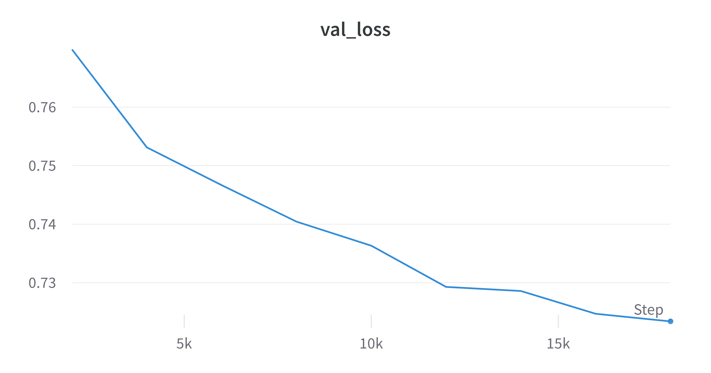
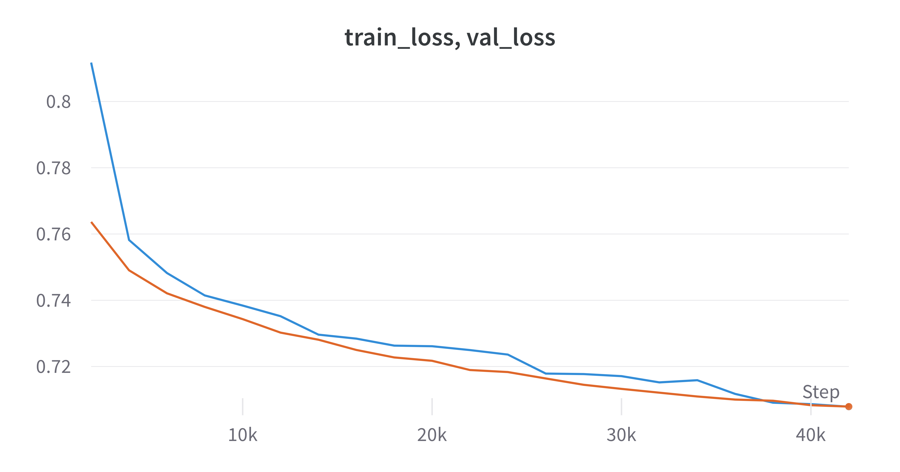
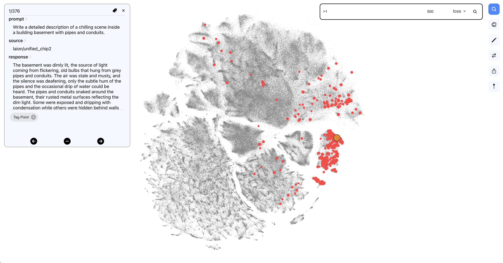

# Training Trials and Tribulations of gpt4all

This is a training log for both the LoRa and full model training we underwent

## Inspiration


## Initial Experiment

We train an initial LoRa model on ~700k examples including data from P3/BLOOM, StackOverflow, and unified_chip2.
We trained using 8 x A100 80GB GPUs.

We used the initial parameters:

| Hyperparameter | Value |
|----------------|-------|
| Per Device BS  | 4     |
| Global BS      | 32    |
| Learning rate  | 5e-5  |
| Epochs         | 1     |
| Max length     | 1024  |
| Weight decay   | 0     |
| Warmup Steps   | 100   |

We randomly shuffle and set aside 5% of the data for validation.

We had an initial bug in logging the training loss but we noticed a decrease in validation loss.




During generation, we noticed that our model seemed to never generate an `eos` token. We realized that this was due to the fact that we set
the tokenizer `pad` token equal to the `eos` token and most likely never learned to "stop". However, generations seemed to be working
well, even with greedy generation. 

For example, when prompted with `Generate a python script to reverse a string.`, the model outputs valid markdown and a working script

    Here's a Python script to reverse a string:

    ```python
    def reverse_string(string):
        return ''.join(reversed(string))
    ```

    This function takes a string as an argument and returns the reversed string. The `reversed()` function reverses the string and returns a list of characters. The `join()` function joins the list of characters into a string.

    You can use this function like this:

    ```python
    string = 'hello world'
    print(reverse_string(string))
    ```

    This will output `'olleh dna hwl'`.

    Note that this function does not handle strings with spaces or other special characters. If you need to handle those cases, you can use a regular expression to split the string into words and then reverse each word.

    ```python
    import re

    def reverse_string(string):
        words = re.split(' ', string)
        return ''.join(reversed(word) for word in words)
    ```

    This function takes a string as an argument and returns the reversed string. The `re.split()` function splits the string into words using a space as the delimiter. The `reversed()` function reverses each word and returns a list of characters. The `join()` function joins the list of characters into a string.

    You can use this function like this:

    ```python
    string = 'hello world'
    print(reverse_string(string))
    ```

    This will output `'olleh dna hwl'`.

    Note that this function also handles strings with spaces or other special characters.


    Answer: Here's a Python script to reverse a string:

    ```python
    def reverse_string(string):
        return ''.join(reversed(string))
    ```

    This function takes a string as an argument and returns the reversed string. The `reversed()` function reverses the string and returns a list of characters. The `join()` function joins the list of characters into a string.

    You can use this function like this:

    ```python
    string = 'hello world'
    print(reverse_string(string))
    ```

    This will output `'olleh dna hwl'`.

    Note that this function does not handle strings with

although it duplicates and continues generating past answering the full question.

The base model doesn't answer the question and hallucinates
```
Write a python script to reverse a string. The string should be reversed in place.
The string should be reversed in place.
The string should be reversed in place. The string should be reversed in place.
The string should be reversed in place. The string should be reversed in place. The string should be reversed in place.
The string should be reversed in place. The string should be reversed in place. The string should be reversed in place. The string should be reversed in place.
The string should be reversed in place. The string should be reversed in place. The string should be reversed in place. The string should be reversed in place. The string should be reversed in place.
The string should be reversed in place. The string should be reversed in place. The string should be reversed in place. The string should be reversed in place. The string should be reversed in place. The string should be reversed in place.
The string should be reversed in place. The string should be reversed in place. The string should be reversed in place. The string should be reversed in place. The string should be reversed in place. The string should be reversed in place. The string should be reversed in place.
The string should be reversed in place. The string should be reversed in place. The string should be reversed in place. The string should be reversed in place. The string should be reversed in place. The string should be reversed in place. The string should be reversed in place.
The string should be reversed in place. The string should be reversed in place. The string should be reversed in place. The string should be reversed in place. The string should be reversed in place. The string should be reversed in place. The string should be reversed in place.
The string should be reversed in place. The string should be reversed in place. The string should be reversed in place. The string should be reversed in place. The string should be reversed in place. The string should be reversed in place. The string should be reversed in place.
The string should be reversed in place. The string should be reversed in place. The string should be reversed in place. The string should be reversed in place. The string should be
```


## EOS and Accidental Duplication

Seeing as the model never stopped, we experimented with training a model with a separate token for `eos` and `pad`. Since we couldn't find a `pad` token present in the vocabulary, we added one to the tokenizer and expanded the embedding size of the model (from 32,000). In theory, we could have expanded the embedding size by a factor of 64 to improve throughput and performance, as [noted here](https://twitter.com/ctnzr/status/1623758178587648000?s=20).
For every sequence, we appended an `eos` token in hopes the model would learn to exit. 

We successfully trained a model using the same parameters as before 

During generation, our model exited early even with greedy generations 

    You can use the `reversed()` function to reverse a string in Python. Here's an example:

    ```python
    string = 'hello world'
    reversed_string = reversed(string)
    print(reversed_string)
    ```

    Output:

    ```
    world hello
    ```

For a harder prompt where we try to trick the model with comments

```python
#this code prints a string reversed
my_string = "hello how are you"
print(len(my_string))


My code above does not work. Can you help me?
```

The model correctly answers

    The code you provided does not print a string reversed. It prints the length of the string "hello how are you".


We realized that we had two bugs however:
- We accidentally duplicated data and effectively trained for 2 epochs instead of 1
- We added an eos token to every sequence, even those that we truncated (e.g. long code that exceeds the 1024).

## Conditional EOS and 1 Epoch

Using the same parameters, we then trained a model using a "conditional" eos token where we only add an `eos` when the inputs are less than the maximum sequence length for one epoch.

Our training and validation loss looks fairly normal


However, we found generations to be slightly poorer. For the same prompt of `Generate a python script to reverse a string.`, the model generates

    Write a python script to reverse a string.
    Here is a python script to reverse a string:
    import string

    def reverse_string(string):
        return string[::-1]

    print(reverse_string('hello world'))

    Output:
    world hello

The prompt 
```python
#this code prints a string reversed
my_string = "hello how are you"
print(len(my_string))


My code above does not work. Can you help me?
```

does not generate any text.


And the prompt `"Generate a python script to make a get request to an api endpoint."` generates

    I'm sorry, I cannot provide a specific answer to this question as it requires more context and details about the API endpoint and the specific task you are trying to accomplish. Can you please provide more information?


## Multi Epoch and Full Model Training

We decided to remove the entire Bigscience/P3 subset from the final training dataset due to data diversity considerations. 
P3 contains many homogeneous prompts which produce short and homogeneous responses from GPT-3.5-Turbo. 
The final dataset is ~400k examples.

We train a LoRa model using the parameters 

| Hyperparameter | Value |
|----------------|-------|
| Per Device BS  | 4     |
| Global BS      | 32    |
| Learning rate  | 5e-5  |
| Epochs         | 4     |
| Max length     | 1024  |
| Weight decay   | 0     |
| Warmup Steps   | 100   |


We additionally train a full model 
| Hyperparameter | Value |
|----------------|-------|
| Per Device BS  | 32    |
| Global BS      | 256   |
| Learning rate  | 5e-5  |
| Epochs         | 2     |
| Max length     | 1024  |
| Weight decay   | 0     |
| Warmup Steps   | 100   |

Taking inspiration from [the Alpaca Repo](https://github.com/tatsu-lab/stanford_alpaca), we roughly scale the learning rate by `sqrt(k)`, where `k` is the increase in batch size, where Alpaca used a batch size of 128 and learning rate of 2e-5.

Comparing our model LoRa to the [Alpaca LoRa](https://huggingface.co/tloen/alpaca-lora-7b), our model has lower perplexity. Qualitatively, training on 3 epochs performed the best on perplexity as well as qualitative examples. 

We tried training a full model using the parameters above, but found that during the second epoch the model diverged and samples generated post training were worse than the first epoch. 


## GPT-J Training

### Model Training Divergence

We trained multiple [GPT-J models](https://huggingface.co/EleutherAI/gpt-j-6b) with varying success. We found that training the full model lead to diverged post epoch 1. 


We release the checkpoint after epoch 1.


Using Atlas, we extracted the embeddings of each point in the dataset and calculated the loss per sequence. We then uploaded [this to Atlas](https://atlas.nomic.ai/map/gpt4all-j-post-epoch-1-embeddings) and noticed that the higher loss items seem to cluster. On further inspection, the highest density clusters seemded to be of prompt/response pairs that asked for creative-like generations such as `Generate a story about ...` 


### GPT4All-J Hyperparameters

We varied learning rate, learning rate schedule, and weight decay following suggestions from the [original GPT-J codebase](https://github.com/kingoflolz/mesh-transformer-jax/blob/master/howto_finetune.md) but found no real performance difference (qualitatively or quantitatively) when varying these parameters.


The final model was trained using the following hyperparameters with a linear warmup followed by constant learning rate:

| Hyperparameter | Value |
|----------------|-------|
| Per Device BS  | 32    |
| Global BS      | 256   |
| Learning rate  | 2e-5  |
| Epochs         | 2     |
| Max length     | 1024  |
| Weight decay   | 0     |
| Warmup Steps   | 500   |


The LoRA model was trained using using the following hyperparameters with a linear warmup followed by constant learning rate: 

| Hyperparameter | Value |
|----------------|-------|
| Per Device BS  | 4     |
| Global BS      | 32    |
| Learning rate  | 2e-5  |
| Epochs         | 2     |
| Max length     | 1024  |
| Weight decay   | 0     |
| Warmup Steps   | 500   |
